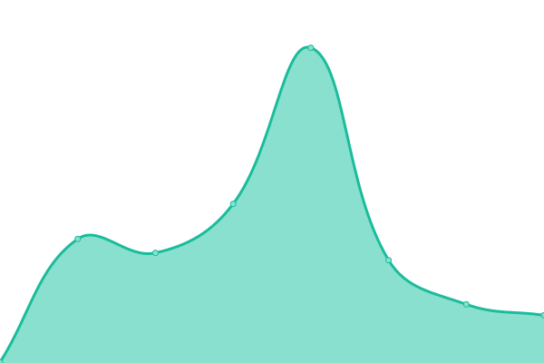

# [📈 Live Status](https://status.yasan.dev): <!--live status--> **🟩 All systems operational**

This repository contains the open-source uptime monitor and status page for [YASAN](https://play.google.com/store/apps/dev?id=5427160200036080377), powered by [Upptime](https://github.com/upptime/upptime).

With [Upptime](https://upptime.js.org), you can get your own unlimited and free uptime monitor and status page, powered entirely by a GitHub repository. We use [Issues](https://github.com/yasandev/upptime/issues) as incident reports, [Actions](https://github.com/yasandev/upptime/actions) as uptime monitors, and [Pages](https://status.yasan.dev) for the status page.

<!--start: status pages-->
<!-- This summary is generated by Upptime (https://github.com/upptime/upptime) -->
<!-- Do not edit this manually, your changes will be overwritten -->
<!-- prettier-ignore -->
| URL | Status | History | Response Time | Uptime |
| --- | ------ | ------- | ------------- | ------ |
|  [Toronto Server](https://www.yasan.dev) | 🟩 Up | [toronto-server.yml](https://github.com/yasandev/upptime/commits/HEAD/history/toronto-server.yml) | 

 194ms
     
 | 

<a href="https://status.yasan.dev/history/toronto-server">100.00%</a>
    

|  [Shop](https://shop.spreadshirt.com/YASAN) | 🟩 Up | [shop.yml](https://github.com/yasandev/upptime/commits/HEAD/history/shop.yml) | 

 308ms
     
 | 

<a href="https://status.yasan.dev/history/shop">100.00%</a>
    

|  [Translation Center](https://translate.yasan.dev) | 🟩 Up | [translation-center.yml](https://github.com/yasandev/upptime/commits/HEAD/history/translation-center.yml) | 

 750ms
     
 | 

<a href="https://status.yasan.dev/history/translation-center">100.00%</a>
    

<!--end: status pages-->

[**Visit our status website →**](https://status.yasan.dev)

## 📄 License

- Powered by: [Upptime](https://github.com/upptime/upptime)
- Code: [MIT](./LICENSE) © [YASAN](https://play.google.com/store/apps/dev?id=5427160200036080377)
- Data in the `./history` directory: [Open Database License](https://opendatacommons.org/licenses/odbl/1-0/)
